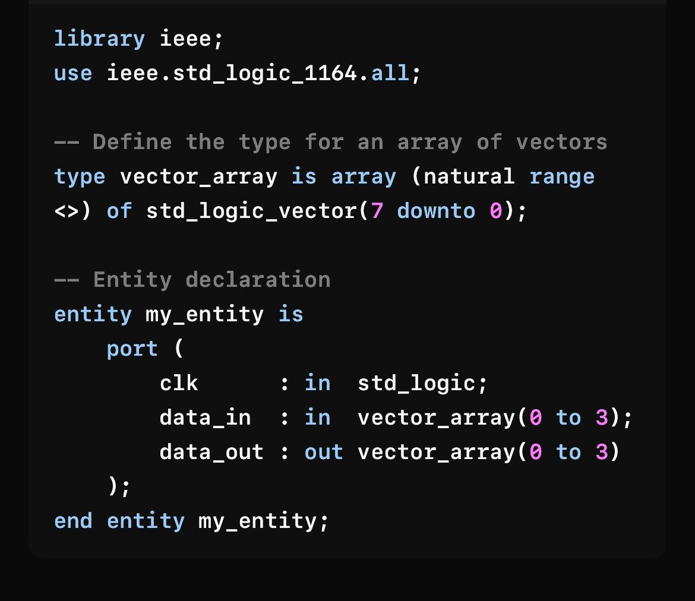

# References

The references used for the project include the images below as well as the listed NandLand website. The original source of the images is not known for certain.

[1] Screenshot of code below

[2] NandLand. Arrays – VHDL Example: Create your own types using arrays. Accessed at: https://nandland.com/arrays/. Date Accessed: approx. April 5, 2025.

