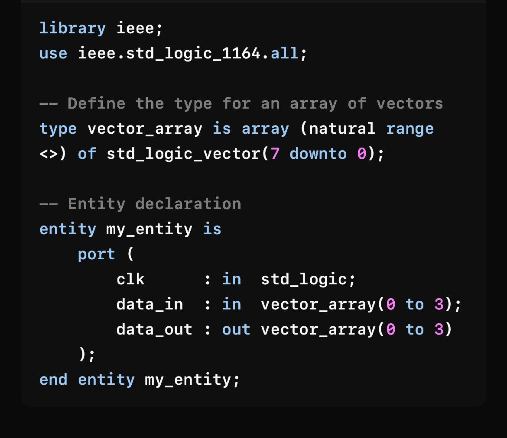
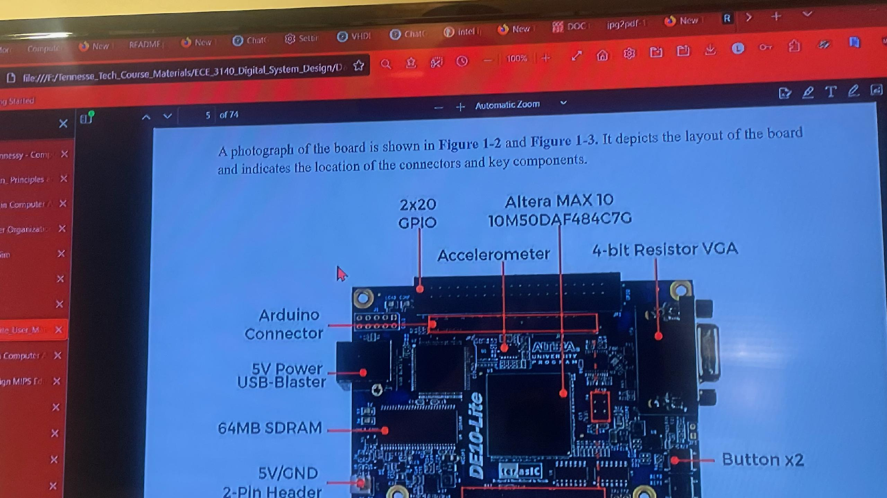

# References

The references used for the project include the images below as well as the listed NandLand website. The original source of the images is not known for certain.

[1] Screenshot of code below. Date Accessed: approx. April 5, 2025 [4]

[2] NandLand. Arrays – VHDL Example: Create your own types using arrays. Accessed at: https://nandland.com/arrays/. Date Accessed: approx. April 5, 2025.

[3] Image from Documentation used to reference the correct configuration of the Altera MAX 10 Board. Date Accessed: approx. April 7, 2025. [4]

[4] Stackoverflow. How do I display local image in markdown? Accessed from: https://stackoverflow.com/questions/41604263/how-do-i-display-local-image-in-markdown. Date Accessed: approx. September 2, 2025.
